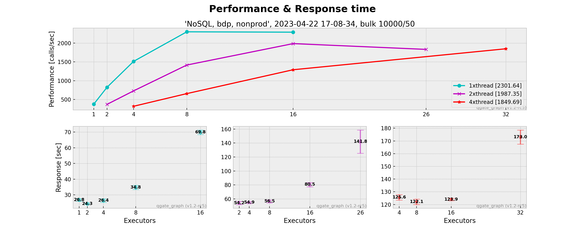

# QGate-Graph

Generate graphs based on performance outputs from Quality Gate solution.

## Usage

    import qgate_graph.graph as grp
    import logging

    # setup login level
    logging.basicConfig()
    logging.getLogger().setLevel(logging.INFO)

    # generate output graphs
    graph=grp.Graph()
    graph.generate_from_dir()

# Outputs

